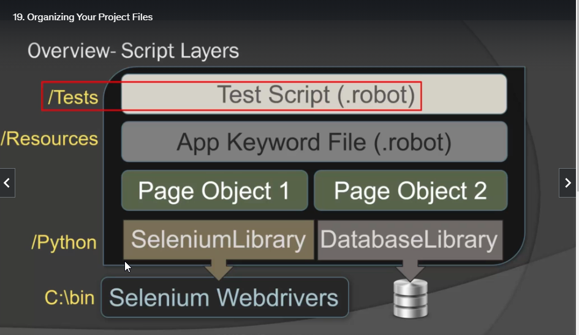
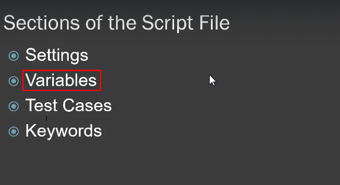
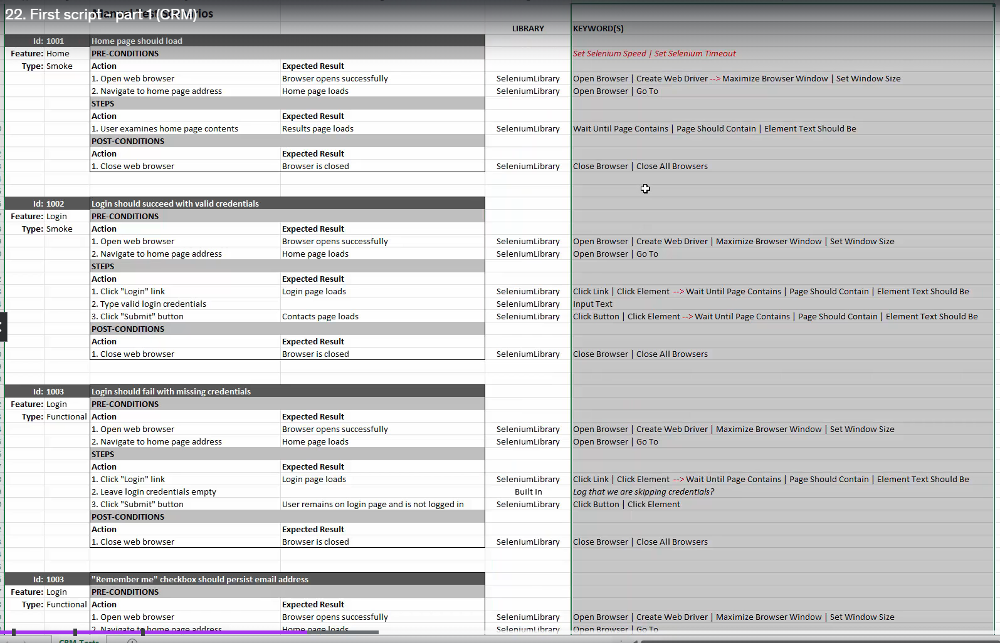

# Notes

### 15-09-2023

- Robot is space separated 2-4 spaces or tabs
- Pipe can also be used '|'
- Test should use natural language so it is easier to undertand -> reason behind the keywords.
- Builtin are installed with robot framework 
- https://robotframework.org/

### 16-09-2023
#### section 5-19

Custom libraries

Folder structure

Multi app test project

#### section 5-20
Robot script sections

On test cases they have square brackets.

First script

